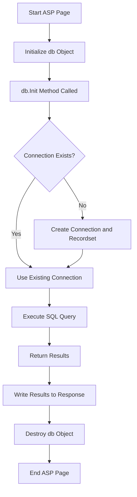

# Reusable Database Connection Class in VBScript

Are you tired of writing the code to connect to a database over and over again? I know I’ve grown very tired of it. So, I decided it was time to build a reusable class to handle the connection and recordset objects I use in almost all of my projects.

## The Concept: VBScript Class

Here is the code for the class that abstracts away the repetitive database connection logic:

```script
Class DataBaseFunctions

    ' Declare variables to have public scope.
    Public rs
    Public cn

    ' Method to initialize connection to the database.
    Private Sub Init
        If isObject(cn) = False Then
            Set cn = Server.CreateObject("ADODB.Connection")
            Set rs = Server.CreateObject("ADODB.Recordset")
            cn.ConnectionString = Application("DB_CONN")
            cn.Open
        End If
    End Sub

    ' Method to destroy objects created.
    Public Sub Destroy
        If isObject(rs) = True Then
            rs.Close
            Set rs = Nothing
        End If
        If isObject(cn) = True Then
            cn.Close
            Set cn = Nothing
        End If
    End Sub

End Class
```
Now, I only need **one line of code** on my ASP page to initialize the database connection. Notice the use of the `Application` object to store the connection string. This has always been a convenient way to store global information and make it easier to change later.

Add this code to your `global.asa` in the `Application_OnStart()` sub to set the `Application("DB_CONN")` variable equal to your database DSN (in this case) or a DSN-less connection string:

```vbscript
Application("DB_CONN") = "DSN=cvDatabase;"
```

## Using the DataBaseFunctions Class in an ASP Page

Here’s how you would use the DataBaseFunctions class in your ASP page:

```html
<HTML>
    <HEAD>
        <!-- #INCLUDE File="class_DataBaseFunctions.asp" -->
    </HEAD>
    <BODY>
        <%
            Set db = New DataBaseFunctions

            db.Init
            Set db.rs = db.cn.Execute("SELECT * FROM tblUser WHERE UserID = 10")

            Response.Write(db.rs.Fields(1).Value)

            db.Destroy
            Set db = Nothing
        %>
    </BODY>
</HTML>
```

## Workflow Diagram (2024 Edit)
To better understand the workflow of the DataBaseFunctions class, here is a visual representation of its lifecycle using Mermaid.


In this diagram:

The process starts with initializing the db object and calling db.Init.
It checks if the connection exists. If not, it creates a new connection and recordset.
The SQL query is executed, and the results are returned to the page.

Finally, the database objects are destroyed, and the page lifecycle ends.
By encapsulating the database logic in a class, this approach reduces redundancy, simplifies code management, and enhances maintainability.

