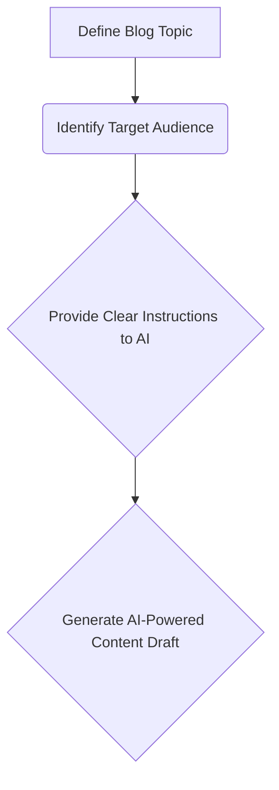

# Creating Blogs with AI: A Step-by-Step Guide with Mermaid Diagrams 🎨🤖

The world of blogging is evolving rapidly, and Artificial Intelligence (AI) is at the forefront of this revolution. No longer a futuristic fantasy, AI-powered tools are now making it easier than ever to create engaging and informative blog content.  Whether you're a seasoned writer or just starting out, this guide will walk you through the process, complete with helpful Mermaid diagrams to visualize each step.

## Why Use AI for Blog Writing?

There are numerous benefits to incorporating AI into your blogging workflow:

* **Time Efficiency:** AI can generate content drafts quickly, freeing up your time for editing, research, and other tasks.
* **Overcoming Writer's Block:** Stuck on a topic? AI can offer suggestions and even complete initial drafts, helping you break through creative hurdles.
* **Content Variety:** Explore different writing styles and formats with ease. AI can help you craft everything from informative articles to creative narratives.
* **Data-Driven Insights:** Some AI tools analyze your audience and suggest topics that resonate with their interests.

## Step-by-Step Guide to Creating Blogs with AI

Let's dive into the practical steps involved in using AI for blog creation:

**1. Choose Your AI Writing Tool:**

* **OpenAI's ChatGPT:** A powerful language model known for its versatility and creative text generation.
* **Jasper.ai:** Designed specifically for marketing and business writing, offering templates for various content types.
* **Copy.ai:** Focuses on generating short-form content like headlines, social media posts, and ad copy.

**2. Define Your Blog Topic & Target Audience:**
   Before you start writing, clearly identify the subject matter of your blog post and who you're writing for. Consider their interests, knowledge level, and pain points.

**3.  Provide AI with Clear Instructions:**
   Be specific about what you want the AI to generate. Use keywords, tone suggestions, desired length, and any other relevant details to guide the output.

**4. Review & Edit the AI-Generated Text:**
  AI can produce impressive results, but it's crucial to review and edit the generated text for accuracy, clarity, and style.

* Check for factual errors and ensure the information aligns with your expertise.
* Refine the language, tone, and flow to make the writing more engaging and readable.
* Add your own insights, perspectives, and examples to personalize the content.

**5. Optimize for Search Engines (SEO):**
  Incorporate relevant keywords throughout your blog post to improve its visibility in search engine results pages (SERPs).

 **6. Publish & Promote Your Blog Post:**
   Share your newly created blog post on social media, email newsletters, and other platforms to reach a wider audience.

## Conclusion

AI is transforming the way we write and consume content. By embracing these powerful tools, you can streamline your blogging process, create high-quality content, and ultimately achieve greater success in reaching your target audience.
