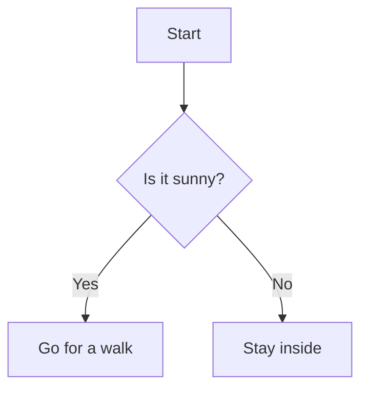
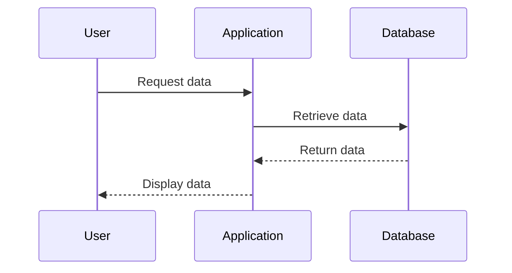
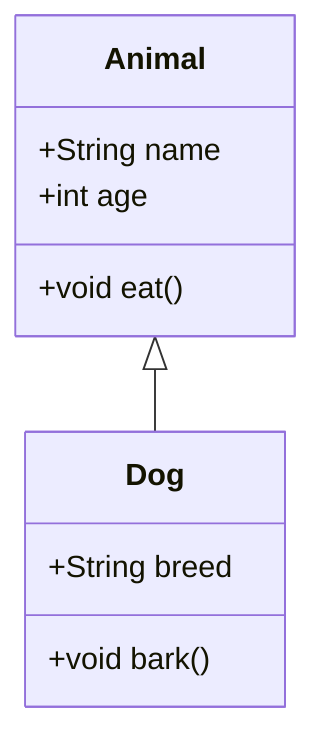
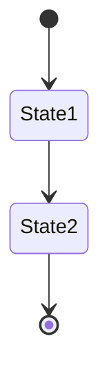
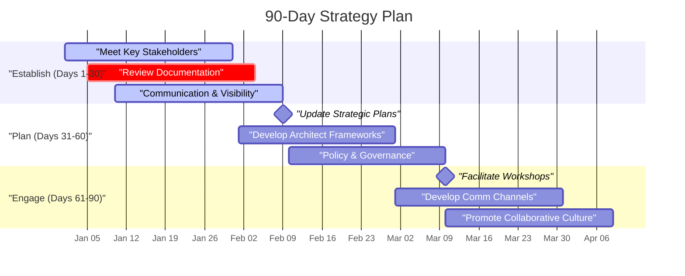



When writing technical documentation or blog posts related to programming, clear and effective diagrams can make a world of difference. Mermaid Markdown provides a simple and impactful way to create diagrams that can be embedded directly within Markdown files. This explainer post will introduce you to using Mermaid Markdown for your programming articles.

## What is Mermaid?

Mermaid is a JavaScript-based diagramming and charting tool that renders Markdown-inspired text definitions to create diagrams dynamically. It's a powerful addition to any documentation toolkit, allowing you to visualize code workflows, algorithms, and any abstract concepts that benefit from visual representation.

## Why Use Mermaid?

- **Ease of Use**: No need for external design software.
- **Consistency**: Easily maintain consistent diagram styles within your documentation.
- **Integrations**: Compatible with many static site generators and Markdown processors.

## Getting Started

To begin using Mermaid, you will need to follow environment-specific steps (like integrating it with your static site generator, adding it to your Markdown processor, etc.). Here, we'll focus on the basics you'll need to get started with Mermaid syntax.

## Basic Mermaid Syntax

Here are a few examples of some common diagram types you can create with Mermaid Markdown.

### Flowchart

A flowchart represents the flow of steps in a process.

```
graph TD
    A[Start] --> B{Is it sunny?}
    B -- Yes --> C[Go for a walk]
    B -- No --> D[Stay inside]
```



### Sequence Diagram

A sequence diagram shows interactions between entities over time.

```
sequenceDiagram
    participant User
    participant Application
    participant Database

    User->>Application: Request data
    Application->>Database: Retrieve data
    Database-->>Application: Return data
    Application-->>User: Display data
```



### Class Diagram

A class diagram represents the structure of a system by showing its classes, attributes, and relationships.

```
classDiagram
    class Animal {
        +String name
        +int age
        +void eat()
    }
    class Dog {
        +String breed
        +void bark()
    }
    Animal <|-- Dog
```



### State Diagram

A state diagram illustrates the states an entity can have and transitions between states.

```
stateDiagram
    [*] --> State1
    State1 --> State2
    State2 --> [*]
```


## Gant Charts

```
gantt
    title 90-Day Strategy Plan
    dateFormat YYYY-MM-DD
    axisFormat %b %d

    section "Establish (Days 1-30)"
    "Meet Key Stakeholders"        : active, task1, 2025-01-01, 30d
    "Review Documentation"         : crit, task2, 2025-01-05, 30d
    "Communication & Visibility"   : active, task3, 2025-01-10, 30d

    section "Plan (Days 31-60)"
    "Update Strategic Plans"       : milestone, task4, 2025-01-26, 28d
    "Develop Architect Frameworks" : task5, 2025-02-01, 28d
    "Policy & Governance"          : task6, 2025-02-10, 28d

    section "Engage (Days 61-90)"
    "Facilitate Workshops"         : milestone, task7, 2025-02-23, 30d
    "Develop Comm Channels"        :task8, 2025-03-01, 30d
    "Promote Collaborative Culture":task9, 2025-03-10, 30d
```



## Embedding Mermaid in Markdown

To embed Mermaid diagrams in Markdown files, you would typically use fenced code blocks with the mermaid descriptor. Here's an example:


When rendered by a Mermaid-aware Markdown processor, this will produce a simple flowchart.


## Conclusion

Incorporating diagrams into your programming articles not only elevates the quality of your documentation but also helps in better conveying complex ideas. Mermaid Markdown provides an efficient and seamless way to add such diagrams. So go ahead, and make your next article both informative and visually appealing!

If you have any questions or need further assistance, feel free to reach out!

Happy diagramming!

---