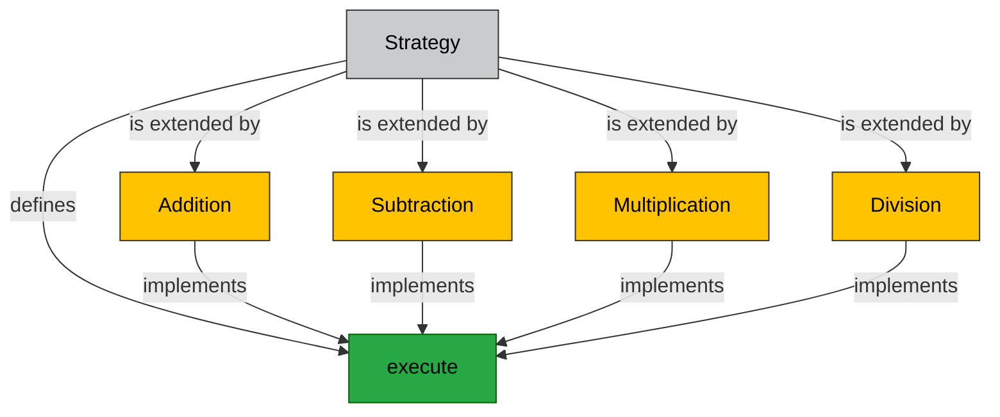

## Introduction

In Object-Oriented Programming (OOP), the Strategy Pattern is a behavioral design pattern that enables selecting an algorithm at runtime. In this article, we'll implement the Strategy Pattern in a JavaScript/NodeJS application to perform basic arithmetic operations: addition, subtraction, multiplication, and division. 

## An example of what we are implementing



## Prerequisites

Make sure you have NodeJS installed on your machine to run the app.

## Setting Up the Project

1. **Create a new directory for your project:**

```bash
mkdir js-strategy-pattern
cd js-strategy-pattern
```

2. **Initialize the project:**

```bash
npm init -y
```

3. **Create an entry file named `app.js`:**

```bash
touch app.js
```

## Implementing the Strategy Pattern

### 1. Define Strategy Interface

We'll start by defining a generic strategy interface for arithmetic operations.

```javascript
// strategy.js
class Strategy {
    execute(a, b) {
        throw new Error('This method should be overridden!');
    }
}

module.exports = Strategy;
```

### 2. Implement Concrete Strategies

Next, we implement specific strategies for addition, subtraction, multiplication, and division.

```javascript
// addition.js
const Strategy = require('./strategy');

class Addition extends Strategy {
    execute(a, b) {
        return a + b;
    }
}

module.exports = Addition;

// subtraction.js
const Strategy = require('./strategy');

class Subtraction extends Strategy {
    execute(a, b) {
        return a - b;
    }
}

module.exports = Subtraction;

// multiplication.js
const Strategy = require('./strategy');

class Multiplication extends Strategy {
    execute(a, b) {
        return a * b;
    }
}

module.exports = Multiplication;

// division.js
const Strategy = require('./strategy');

class Division extends Strategy {
    execute(a, b) {
        if (b === 0) throw new Error('Division by zero');
        return a / b;
    }
}

module.exports = Division;
```

### 3. Create a Context Class

The context class will use the strategy to execute the selected operation.

```javascript
// context.js
class Context {
    constructor(strategy) {
        this.strategy = strategy;
    }

    setStrategy(strategy) {
        this.strategy = strategy;
    }

    executeStrategy(a, b) {
        return this.strategy.execute(a, b);
    }
}

module.exports = Context;
```

### 4. Using the Strategy Pattern in the Application

Now let's tie everything together in the `app.js` file.

```javascript
// app.js
const Addition = require('./addition');
const Subtraction = require('./subtraction');
const Multiplication = require('./multiplication');
const Division = require('./division');
const Context = require('./context');

const context = new Context(new Addition());

console.log("Addition: ", context.executeStrategy(5, 3)); // Output: 8

context.setStrategy(new Subtraction());
console.log("Subtraction: ", context.executeStrategy(5, 3)); // Output: 2

context.setStrategy(new Multiplication());
console.log("Multiplication: ", context.executeStrategy(5, 3)); // Output: 15

context.setStrategy(new Division());
console.log("Division: ", context.executeStrategy(5, 3)); // Output: 1.666...
```

### 5. Running the Application

Now, run your application:

```bash
node app.js
```

You should see the following output:

```plaintext
Addition:  8
Subtraction:  2
Multiplication:  15
Division:  1.6666666666666667
```

## Conclusion

In this article, we've implemented the Strategy Pattern using JavaScript and NodeJS to create a simple arithmetic operations application. This design pattern allows easy addition of new strategies without changing existing code, promoting scalability and maintainability. 

Feel free to expand on this pattern by adding more operations or enhancing error handling. Happy coding!

[GitHub - Sample Code for Javascript Strategy Pattern](https://github.com/codevalve/js-strategy-pattern)