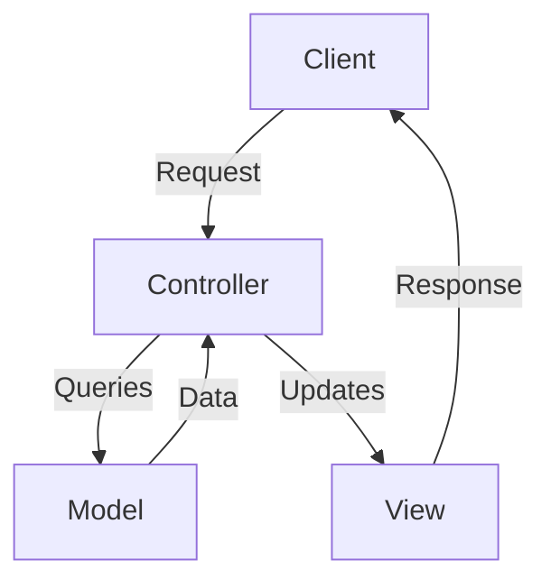

# Intro

Model-View-Controller (MVC) is a popular design pattern that helps in structuring applications in a way that separates concerns, making the codebase more manageable and scalable. When it comes to web development using ExpressJS, adopting the MVC pattern can provide numerous benefits. In this article, we'll explore the advantages of using the MVC pattern in ExpressJS applications.

### Podcast

<audio ref='postcast' src="https://codevalve.com/wp-content/uploads/2024/09/CodeValve-Podcast-The-Benefits-of-the-MVC-Pattern.mp3" controls></audio>


## What is MVC?

MVC stands for Model-View-Controller, and it divides an application into three interconnected components:

- **Model:** Manages the data and business logic of the application. It directly interacts with the database and represents the data that is being transferred between the Controller and the View.
- **View:** Represents the UI components and is responsible for displaying the data provided by the Model. It is essentially what the user interacts with.
- **Controller:** Acts as an intermediary between the Model and the View. It processes incoming requests, manipulates data using the Model, and sends the output data to the View.

Here's a simple visual representation to help illustrate the relationships between these components:



## Benefits of Using MVC in ExpressJS

### 1. Separation of Concerns

One of the core principles of the MVC pattern is the clear separation of concerns. By dividing the application into three distinct components, each with a specific responsibility, you can:

- **Simplify Maintenance:** Each component can be changed or updated independently without affecting the others.
- **Improve Readability:** Code is more organized and easier to read, making it more straightforward for new developers to understand the structure of the application.
- **Enhance Reusability:** Components can be reused across different parts of the application or even in other projects.

### 2. Scalability

With a clear separation of concerns, scaling your application becomes much easier. Whether you're adding new features, optimizing performance, or handling increased traffic, the modular structure of MVC allows you to scale each component independently.

- **Horizontal Scaling:** Easily distribute different components across multiple servers.
- **Vertical Scaling:** Efficiently optimize resource usage for each component.

### 3. Facilitate Testing

Testing becomes more manageable with the MVC pattern due to the decoupled nature of the components. You can write unit tests for each component in isolation:

- **Model Testing:** Validate the business logic and data manipulations.
- **Controller Testing:** Ensure the routing and request handling are accurate.
- **View Testing:** Verify that the UI displays the data correctly.

### 4. Collaborative Development

In a team environment, the MVC pattern enables more efficient collaborative development. Different team members can work on separate components simultaneously:

- **Frontend Developers:** Focus on building and styling the views.
- **Backend Developers:** Work on the controllers and models to manage business logic and data operations.

### 5. Flexibility and Extensibility

The modular structure of MVC makes it easier to introduce new features or modify existing ones without overhauling the entire codebase. You can:

- **Add New Routes and Views:** Simply by adding new controllers and views without impacting the model.
- **Integrate New Data Sources:** By extending or modifying the model component.

### Implementing MVC in ExpressJS

Let's look at a basic implementation of the MVC pattern in an ExpressJS application.

1. **Setting Up the Project Structure:**
    ```bash
    myapp/
    ├── app.js
    ├── controllers/
    │   └── userController.js
    ├── models/
    │   └── userModel.js
    ├── routes/
    │   └── userRoutes.js
    └── views/
        └── userView.ejs
    ```

2. **Model (userModel.js):**
   ```javascript
   // models/userModel.js
   const mongoose = require('mongoose');

   const userSchema = new mongoose.Schema({
       name: String,
       email: String,
   });

   const User = mongoose.model('User', userSchema);

   module.exports = User;
   ```

3. **Controller (userController.js):**
   ```javascript
   // controllers/userController.js
   const User = require('../models/userModel');

   exports.getUser = async (req, res) => {
       try {
           const user = await User.findById(req.params.id);
           res.render('userView', { user });
       } catch (err) {
           res.status(500).send(err);
       }
   };
   ```

4. **Routes (userRoutes.js):**
   ```javascript
   // routes/userRoutes.js
   const express = require('express');
   const userController = require('../controllers/userController');
   const router = express.Router();

   router.get('/users/:id', userController.getUser);

   module.exports = router;
   ```

5. **View (userView.ejs):**
   ```html
   <!-- views/userView.ejs -->
   <!DOCTYPE html>
   <html lang="en">
   <head>
       <meta charset="UTF-8">
       <meta name="viewport" content="width=device-width, initial-scale=1.0">
       <title>User Profile</title>
   </head>
   <body>
       <h1><%= user.name %></h1>
       <p>Email: <%= user.email %></p>
   </body>
   </html>
   ```

6. **Main Application File (app.js):**
   ```javascript
   // app.js
   const express = require('express');
   const mongoose = require('mongoose');
   const userRoutes = require('./routes/userRoutes');

   const app = express();

   mongoose.connect('mongodb://localhost:27017/myapp', {
       useNewUrlParser: true,
       useUnifiedTopology: true,
   });

   app.set('view engine', 'ejs');

   app.use('/', userRoutes);

   app.listen(3000, () => {
       console.log('Server is running on port 3000');
   });
   ```

## Conclusion

The MVC pattern brings a lot to the table when developing applications with ExpressJS. By promoting separation of concerns, enhancing scalability, facilitating testing, and enabling collaborative development, MVC can significantly improve the maintainability and flexibility of your codebase. If you haven't already adopted MVC in your ExpressJS projects, it's worth considering to help you build more robust and manageable applications.