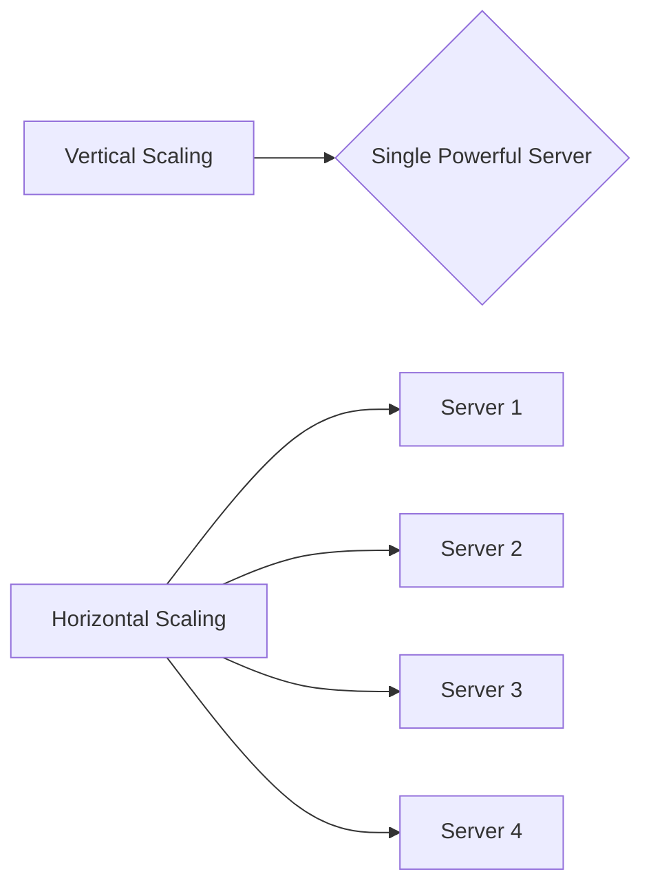
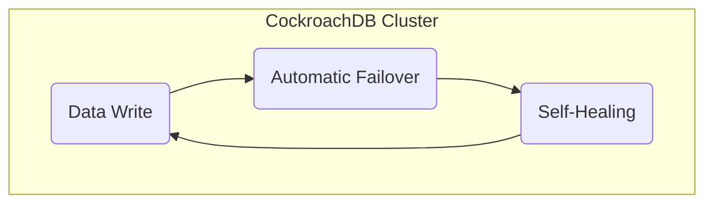

## CockroachDB - Why It's a Good Choice Over Microsoft SQL Server

Selecting the right database for your application can be a challenging task given the variety of available options, each with its pros and cons. CockroachDB has emerged as a strong contender, especially when compared to traditional databases like Microsoft SQL Server. Here's why:

### Horizontal Scalability

Unlike Microsoft SQL Server, which primarily scales vertically (by adding more power to a single server), CockroachDB is built for horizontal scalability. This means it can spread across multiple nodes effortlessly, making it ideal for cloud-native environments. 

#### Diagram: Horizontal vs. Vertical Scalability

### PostgreSQL-Compatible

CockroachDB is SQL syntax and API compatible with PostgreSQL. This makes the migration process less cumbersome and provides a more flexible and developer-friendly environment. With this compatibility, existing PostgreSQL tools and libraries can be reused, significantly reducing the time and effort required to adapt to a new database system.

### Fault Tolerance

CockroachDB is designed from the ground up for high availability and fault tolerance. Key features include:

- **Automatic Failover:** The system automatically manages failures and ensures that the application remains available without manual intervention.
- **Self-Healing:** CockroachDB can automatically detect and correct inconsistencies in its data, ensuring that the system remains consistent and reliable.

#### Diagram: High Availability and Fault Tolerance in CockroachDB

## Downsides

Still evolving: As a relatively newer database, it might not be as mature or well-supported as PostgreSQL or MariaDB for some specific workloads.
Resource consumption: Its fault-tolerant design comes at the cost of higher resource consumption.

### Conclusion

While Microsoft SQL Server is a powerful and highly reliable database system, it lacks some of the modern features necessary for cloud-native applications. CockroachDB offers several advantages, including horizontal scalability, PostgreSQL compatibility, and robust fault tolerance, making it a compelling choice for modern distributed applications.

By considering these key points, it's clear that CockroachDB can provide significant benefits over Microsoft SQL Server, especially in environments that demand scalability, flexibility, and high availability.
