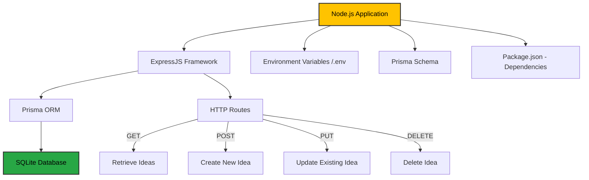

In this article, we will walk through creating a simple ExpressJS web application that adheres to the 12 Factor App methodology. We'll use Prisma as the ORM to interact with a SQLite database and build a CRUD application for collecting ideas for content. Let's dive in!

## Here is what we are going to implement



## Prerequisites
- Basic understanding of JavaScript and Node.js
- Node.js and npm installed
- A code editor like VS Code

## Step 1: Setting Up Your Environment

First, ensure you have Node.js and npm installed. You can verify your setup by running:

```bash
node -v
npm -v
```

Create a new directory for your project and initialize a new Node.js application:

```bash
mkdir express-prisma-ideas
cd express-prisma-ideas
npm init -y
```

## Step 2: Installing Dependencies

We'll need ExpressJS, Prisma, and SQLite dependencies. Install them by running:

```bash
npm install express prisma @prisma/client sqlite3
```

Next, initialize Prisma:

```bash
npx prisma init
```

This command will set up a new Prisma project with a `prisma` directory containing a `schema.prisma` file and update your `.env` file with the database connection URL.

### Configuring SQLite Database

In your `.env` file, set up the `DATABASE_URL` to use a SQLite database:

```plaintext
DATABASE_URL="file:./dev.db"
```

## Step 3: Defining the Data Model

Edit `prisma/schema.prisma` to define your data model:

```javascript
datasource db {
  provider = "sqlite"
  url      = env("DATABASE_URL")
}

generator client {
  provider = "prisma-client-js"
}

model Idea {
  id        Int      @id @default(autoincrement())
  title     String
  content   String
  createdAt DateTime @default(now())
  updatedAt DateTime @updatedAt
}
```

Run the following commands to create the SQLite database and generate the Prisma client:

```bash
npx prisma migrate dev --name init
npx prisma generate
```

## Step 4: Setting Up ExpressJS Application

Create an entry point file named `index.js` and set up ExpressJS:

```javascript
const express = require('express');
const { PrismaClient } = require('@prisma/client');
const bodyParser = require('body-parser');

const app = express();
const prisma = new PrismaClient();

app.use(bodyParser.json());
app.use(bodyParser.urlencoded({ extended: true }));

const PORT = process.env.PORT || 3000;

// Routes
app.get('/ideas', async (req, res) => {
  const ideas = await prisma.idea.findMany();
  res.json(ideas);
});

app.post('/ideas', async (req, res) => {
  const { title, content } = req.body;
  const newIdea = await prisma.idea.create({ data: { title, content } });
  res.json(newIdea);
});

app.put('/ideas/:id', async (req, res) => {
  const { id } = req.params;
  const { title, content } = req.body;
  const updatedIdea = await prisma.idea.update({ where: { id: parseInt(id) }, data: { title, content } });
  res.json(updatedIdea);
});

app.delete('/ideas/:id', async (req, res) => {
  const { id } = req.params;
  await prisma.idea.delete({ where: { id: parseInt(id) } });
  res.json({ message: 'Idea deleted' });
});

// Start server
app.listen(PORT, () => {
  console.log(`Server is running on port ${PORT}`);
});
```

## Step 5: Adhering to the 12 Factor App Methodology

### I. Codebase
The project must be tracked in a version control system like Git.

```bash
git init
```

### II. Dependencies
All dependencies are declared in `package.json`.

### III. Config
Environment-specific configurations should be stored in environment variables, as seen in the `.env` file.

### IV. Backing Services
Use Prisma to manage database connections and interactions.

### V. Build, Release, Run
Separate the build and release stages. Note: In simple projects, `package.json` scripts can ensure the app runs correctly.

### VI. Processes
Ensure the app is stateless by keeping all necessary state in the database.

### VII. Port Binding
Use environment variables to define the port, and bind the app to a specified port.

### VIII. Concurrency
Handle different workloads by scaling app processes.

### IX. Disposability
Ensure the app can start up fast and shut down gracefully. Implement any necessary cleanup codes.

### X. Dev/Prod Parity
Keep development, staging, and production environments as similar as possible.

### XI. Logs
Treat logs as event streams.

### XII. Admin Processes
Run one-off admin processes as needed using a minimalistic approach, usually by scripts.

## Conclusion

We've built a simple ExpressJS application using Prisma with a SQLite database while ensuring it follows the 12 Factor App methodology. This application model is scalable, maintainable, and easy to deploy across different environments.

Happy coding!