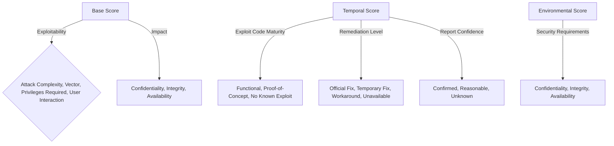

## Intro

As Linux continues to dominate the world of servers, cloud environments, and IoT devices, the landscape of cyber threats targeting Linux-based systems has evolved significantly. Understanding the nature of these threats, how they are tracked, and the mechanisms in place for handling vulnerabilities is crucial for maintaining robust security.

### Podcast

<audio ref='podcast' src="https://codevalve.com/wp-content/uploads/2024/09/Evolving-Cyber-Threats-to-Linux-Based-Systems.mp3" controls></audio>

### Evolving Threats

Linux-based systems face a range of cyber threats, including:

- **Malware and Ransomware:** Although historically considered safer from malware, Linux systems have become targets due to their growing prevalence.
- **Exploits and Vulnerabilities:** Bugs and misconfigurations in software can be exploited to gain unauthorized access or escalate privileges.
- **Insider Threats:** Malicious actions by individuals within the organization can lead to significant damage, especially if they have administrative access.

### Tracking Cyber Threats

The tracking of cyber threats involves multiple layers of monitoring, reporting, and collaborative efforts. Here are some key components:

- **Threat Intelligence Platforms (TIPs):** Platforms like AlienVault and Recorded Future aggregate and analyze vast amounts of threat data, offering insights into emerging threats.
- **Community Contributions:** Security researchers and ethical hackers contribute by reporting new vulnerabilities and sharing findings through platforms like Bugzilla and GitHub repositories.
- **Security Information and Event Management (SIEM):** Tools such as Splunk and Elastic Stack collect and analyze event data, detecting anomalies and potential threats.

### Vulnerability Scoring

To assess and prioritize vulnerabilities, the Common Vulnerability Scoring System (CVSS) is widely used. CVSS provides a numerical score (0-10) representing the severity of a vulnerability based on several criteria, including:

- **Exploitability:** How easily the vulnerability can be exploited.
- **Impact:** The potential damage or impact if the vulnerability is exploited.
- **Environment:** Factors like application context and system configuration.

Here is a CVSS scoring breakdown:

### Example Vulnerability

A recent critical unauthenticated remote code execution (RCE) flaw illustrates the severity of these vulnerabilities. Read more about this specific vulnerability [here](https://cybersecuritynews.com/critical-unauthenticated-rce-flaw/).

### Responsibility for Fixing or Mitigating Vulnerabilities

Responsibility for addressing these vulnerabilities typically falls across several roles:

- **Developers:** Responsible for writing secure code and timely patching vulnerabilities in their applications.
- **System Administrators:** Ensuring systems are kept up-to-date with security patches and configurations.
- **Security Teams:** Monitoring systems, performing penetration testing, and applying security best practices.
- **Users:** Practicing safe usage habits and reporting unusual behavior promptly.

### Conclusion

With the cyber threat landscape continuing to evolve, maintaining the security of Linux-based systems requires a comprehensive understanding of threats, diligent tracking, and systematic handling of vulnerabilities. Collaboration among developers, administrators, security professionals, and users is key to defending against these threats effectively.