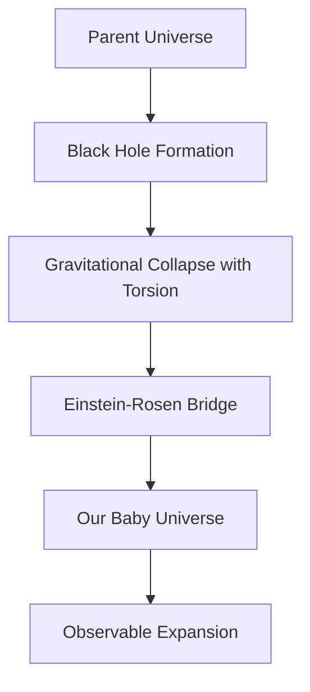


<link rel="stylesheet" href="https://cdn.jsdelivr.net/npm/katex@latest/dist/katex.min.css" />


## Key Points

- Research suggests our universe might be inside a black hole, but this idea is debated.
- JWST data shows early galaxies rotating in the same direction, hinting at a rotating universe.
- The Einstein-Cartan theory proposes new universes form inside black holes, avoiding singularities.
- Some scientists argue galaxy rotation may be influenced by the Milky Way instead.

## Overview

The idea that our universe is inside a black hole is a fascinating hypothesis in cosmology. This could explain how the universe started, especially in light of recent findings from the James Webb Space Telescope (JWST). However, competing theories and data suggest more study is needed.

## Evidence Supporting the Idea

### JWST Observations

JWST observed 263 early galaxies and found ~67% rotate clockwise, suggesting an inherent cosmic rotation, possibly inherited from a rotating black hole ([Monthly Notices](#key-citations)).

### Galaxy Spiral Asymmetry

A 2011 study of over 15,000 galaxies showed a hemispherical asymmetry in spiral orientations, supporting the rotating universe theory ([Physics Letters B](#key-citations)).

### Einstein-Cartan Theory

This theory avoids singularities by introducing torsion. It suggests:

- New universes form inside black holes via a big bounce.
- Torsion acts as a repulsive force, explaining universe expansion.
- The arrow of time is inherited from a parent universe.

### Connection to Dark Energy

Torsion might also explain dark energy as a repulsive force without invoking unknown components ([Phys.org](#key-citations)).

## Mermaid Diagram: Theoretical Framework

## Controversies and Alternatives

- Some researchers argue galaxy rotation patterns might be influenced by our Milky Way ([ScienceAlert](#key-citations)).
- Others consider the equality of the Hubble radius \frac{c}{H} and Schwarzschild radius \frac{2GM}{c^2} to be a coincidence.
- Lambda-CDM model still broadly accepted, but challenged by JWST and Planck findings.

## Theoretical Foundations

Black hole cosmology suggests our universe lies inside a black hole from a parent universe.

### Key Equations

- **Hubble Radius**: \R_H = \frac{c}{H}
- **Schwarzschild Radius**: \R_s = \frac{2GM}{c^2}

This near equality in our universe may support black hole cosmology, but could also be coincidental.

## Observational Evidence

| Category | Evidence | Source |
|----------|----------|--------|
| JWST Galaxy Rotations | 67% of 263 galaxies rotate clockwise | [Monthly Notices](#key-citations) |
| Galaxy Spiral Asymmetry | Hemispherical asymmetry in 15,000+ galaxies | [Physics Letters B](#key-citations) |
| Hubble-Schwarzschild | Hubble \approx Schwarzschild radius | [Wikipedia](#key-citations)|
| Theoretical Support | Torsion theory explains Big Bang and dark energy | [Physics Letters B, Phys Rev D](#key-citations) |

## Implications and Future Directions

If confirmed, this hypothesis could:

- Explain cosmic inflation and universe homogeneity.
- Suggest a nested multiverse of baby universes within black holes.
- Align time’s directionality with inherited traits from parent universes.

Further data from JWST and deeper studies of torsion and rotational asymmetries could test these ideas.

## Conclusion

Black hole cosmology is a compelling but debated hypothesis. JWST observations, theoretical advances in Einstein-Cartan gravity, and spiral galaxy studies support the idea. Still, alternative explanations and controversies persist, underscoring the need for continued exploration.

## Key Citations

- [Monthly Notices of the Royal Astronomical Society 2025 galaxy rotation study - Volume 699, Issue 4, 16 May 2011, Pages 224-229](https://academic.oup.com/mnras/article/538/1/76/8019798)
- [Physics Letters B 2010 cosmology with torsion paper - Volume 694, Issue 3, 8 November 2010, Pages 181-185](https://doi.org/10.1016/j.physletb.2011.04.008)
- [Physical Review D 2012 nonsingular big-bounce universe paper - Phys. Rev. D 83, 084033 – Published 19 April, 2011](https://doi.org/10.1103/PhysRevD.83.084033)
- [Physics Letters B 2011 galaxy spiral asymmetry study](https://www.sciencedirect.com/science/article/pii/S0370269311003947?via%3Dihub)
- [Wikipedia black hole cosmology overview](https://en.wikipedia.org/wiki/Black_hole_cosmology)
- [MIT Technology Review 2010 universe inside black hole article](https://www.technologyreview.com/2010/07/13/121442/why-our-universe-must-have-been-born-inside-a-black-hole/)
- [Space.com JWST discovery and black hole cosmology](https://www.space.com/space-exploration/james-webb-space-telescope/is-our-universe-trapped-inside-a-black-hole-this-james-webb-space-telescope-discovery-might-blow-your-mind)
- [Discovery universe inside every black hole article](https://www.discovery.com/science/Universe-Inside-Every-Black-Hole)
- [Gizmodo JWST findings and black hole hypothesis](https://gizmodo.com/a-surprising-number-of-galaxies-rotating-in-lockstep-could-mean-were-in-a-black-hole-2000575624)
- [ScienceAlert universe inside black hole explanation](https://www.sciencealert.com/the-entire-universe-could-exist-inside-a-black-hole-heres-why)
- [Phys.org black hole universe theory explanation](https://phys.org/news/2012-05-black-hole-universe-physicist-solution.html)
